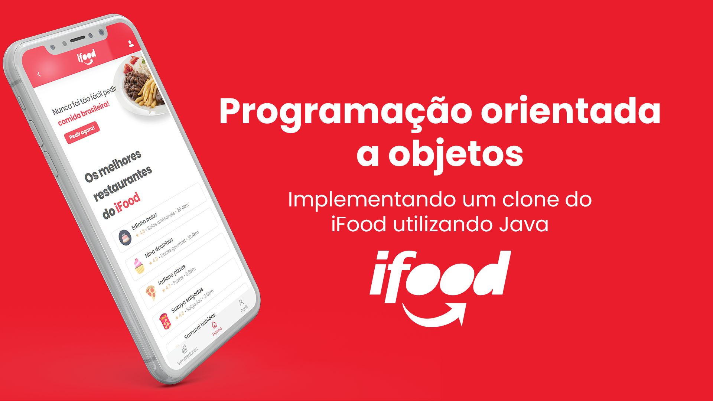

# iFood clone 📱



## Como executar o projeto?

### Front-end 💻

Requisitos

- Node
- NPM
- Yarn (opcional)

Dentro da pasta front-end

#### Instalar as dependências (usando o NPM)

```sh
$ npm i
```

Executar a aplicação

```sh
$ npm run dev
```

#### Instalar as dependências (Yarn)

```sh
$ yarn
```

Executar a aplicação

```sh
yarn dev
```

## Backend 🎲

Requisitos

- Java >= 11
- Banco de dados `MariaDB`
- Maven

# Autores

- [Eder Lima](https://github.com/Nxrth-x)
- [Élida Castro](https://github.com/elidacastro)
- [Victória Sampaio](https://github.com/Suzuyay)
- [Vinícius Henrique](https://github.com/indiano-jpg)
- [Vinícius Rodrigues](https://github.com/viniccin)
